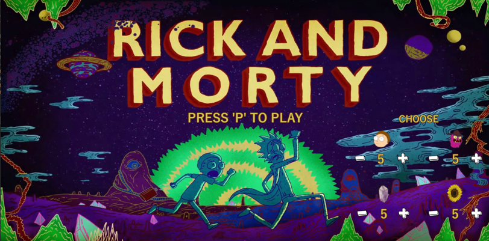

[![LinkedIn][linkedin-shield]][linkedin-url]
[![GitHub][github-shield]][github-url]
[![itch.io][itch-shield]][itch-url]
[![Instagram][instagram-shield]][instagram-url]
[![Youtube][youtube-shield]][youtube-url]
[![ArtStation][artstation-shield]][artstation-url]

<!-- PROJECT LOGO -->
 

  

<h3 align="center">Natural Selection Simulator - Rick and Morty</h3>

  

    This project represents an ecosystem of Natural Selection of the population of the Rick and Morty series that involves the characters Rick, Morty, Mr Meeseeks and Monsters.
     
     
    >>
    <a href="https://youtu.be/TCHB_26fAiA">View Demo</a>
    <<
  

<!-- ABOUT THE PROJECT -->
## About The Project

Items are generated for consumption by some characters, such as Flowers for Monsters and Jewels for Mortys.

The user is represented by Rick, Rick has the power to generate a Morty when the keyboard “M” is clicked. 
There can only be a maximum of 10 Mortys in the arena.

Morty searches for Jewels scattered around the scene and for every two Jewels, a Mr Meeseeks is generated. 

Mr Meeseeks chase the Monsters and when they kill a monster, they disappear, because, in the context of the series, when the wish destined for Mr Meeseeks is fulfilled, he disappears.

Monsters eat flowers and Mortys. By eating three flowers, they generate a new Monster. Monsters will be more likely to eat Mortys and will only prefer flowers if no Morty enters their field of vision.

The ecosystem can be fully manipulated by the user.

(<a href="#top">back to top</a>)

### Built With

* [Java](https://www.oracle.com/java/)
* [Processing](https://processing.org/)

(<a href="#top">back to top</a>)

## Credits

Programmer / Artist - Beatriz Sá

Programmer - Rogério Fernandes

Programmer - André Almeida

(<a href="#top">back to top</a>)

<!-- CONTACT -->
## Contact

Email - beatrizsa1906@gmail.com

Portfolio - Still in Development

Itch.io - [https://barrythecoolbee.itch.io/](https://barrythecoolbee.itch.io/)

LinkedIn - [https://www.linkedin.com/in/beatriz-s%C3%A1-857a64222/](https://www.linkedin.com/in/beatriz-s%C3%A1-857a64222/)

Instagram - [https://www.instagram.com/barrythecoolbee/](https://www.instagram.com/barrythecoolbee/)

Youtube - [https://www.youtube.com/channel/UCuzo8NbNm7MCut_lDQ7WNvw](https://www.youtube.com/channel/UCuzo8NbNm7MCut_lDQ7WNvw)

ArtStation - [https://www.artstation.com/barrythecoolbee](https://www.artstation.com/barrythecoolbee)

Project Link - [https://github.com/barrythecoolbee/NaturalSelectionSimulator](https://github.com/barrythecoolbee/NaturalSelectionSimulator)

(<a href="#top">back to top</a>)

[linkedin-shield]: https://img.shields.io/badge/-LinkedIn-black.svg?style=for-the-badge&logo=linkedin&colorB=555
[linkedin-url]: https://www.linkedin.com/in/beatriz-s%C3%A1-857a64222/
[github-shield]: https://img.shields.io/badge/-GitHub-black.svg?style=for-the-badge&logo=github&colorB=555
[github-url]: https://github.com/barrythecoolbee
[itch-shield]: https://img.shields.io/badge/-itch.io-black.svg?style=for-the-badge&logo=itch.io&colorB=555
[itch-url]: https://barrythecoolbee.itch.io/
[instagram-shield]: https://img.shields.io/badge/-Instagram-black.svg?style=for-the-badge&logo=instagram&colorB=555
[instagram-url]: https://www.instagram.com/barrythecoolbee/
[youtube-shield]: https://img.shields.io/badge/-Youtube-black.svg?style=for-the-badge&logo=youtube&colorB=555
[youtube-url]: https://www.youtube.com/channel/UCuzo8NbNm7MCut_lDQ7WNvw
[artstation-shield]: https://img.shields.io/badge/-ArtStation-black.svg?style=for-the-badge&logo=artstation&colorB=555
[artstation-url]: https://www.artstation.com/barrythecoolbee
